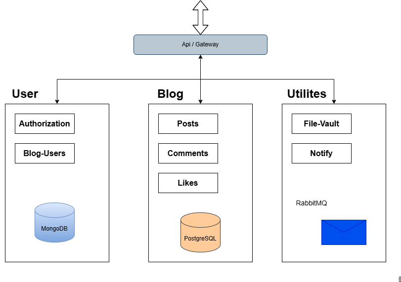

# Readme. Простой движок для блога

## О проекте

«Readme» — это простой headless-движок для блога, построенный с помощью микросервисной архитектуры и современного фреймворка Nest.js. Проект состоит из нескольких микросервисов [(схема проекта)](#схема-проекта), каждый сервис решает одну задачу.

## Инструкции для запуска проекта

Рабочая директория - **project**

```
cd ./project
```

1. Перейти в рабочую директорию и установить зависимости

```
npm i
```

2. Задать переменные окружения

```
# Скопировать .env.example -> .env:
cp apps/account/.env.example apps/account/.env
cp apps/api/.env.example apps/api/.env
cp apps/blog/.env.example apps/blog/.env
cp apps/file-vault/.env.example apps/file-vault/.env
cp apps/notify/.env.example apps/notify/.env
```

3. Развернуть Docker

```
npx nx run account:docker:up
npx nx run blog:docker:up
npx nx run file-vault:docker:up
npx nx run notify:docker:up
```

Завершить docker можно соответсвующей командой

`npx nx run <service>:docker:up`

4. Сформировать Prisma

```
npx nx run blog:db:generate
npx nx run blog:db:migrate
```

5. Запуск сервисов

```
npx nx run account:serve
npx nx run blog:serve
npx nx run file-vault:serve
npx nx run notify:serve
npx nx run api:serve
```

## Документация

Документирование выполнено с помощью встроенных средств в фреймворк Nest.
С переменными окружения по умолчанию доступно по ссылкам

```
http://localhost:5000/api - api
http://localhost:3000/api - account
http://localhost:4000/api - blog
http://localhost:7000/api - notify
http://localhost:8000/api - file-vault
```

## Полезные ссылки

Проверьте порты, которые указали в `.env` файлах

http://localhost:8082/browser/ - pgAdmin

http://localhost:8081/ - MongoExpress

http://localhost:1085/ - FakeSMTPServer

http://localhost:1088/ - RabbitMQ

Очистка кеша nx - `npx nx reset`

## Схема проекта


